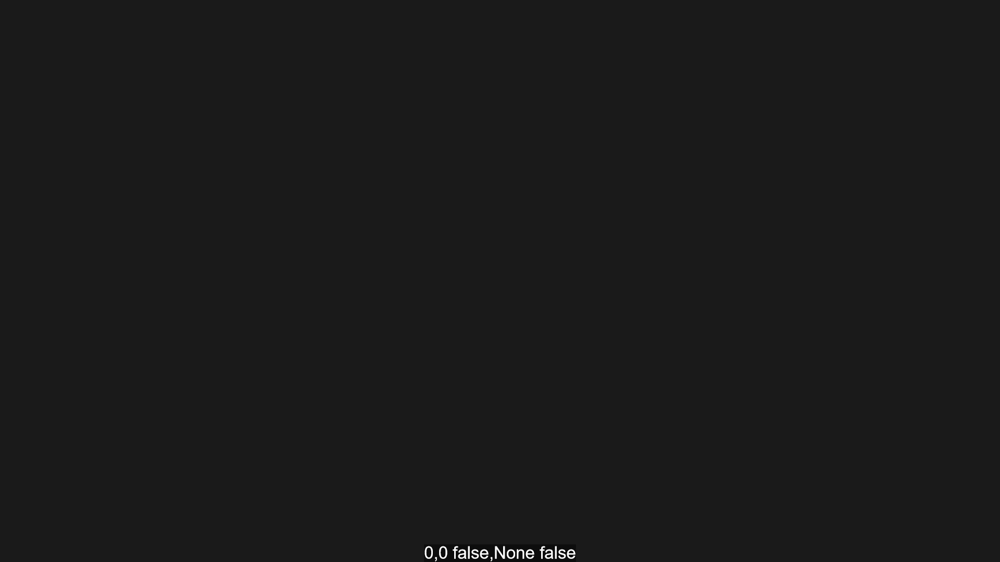

An overlay that draws all mouse information using `pjsAfterUpdate`. Shows mouse pos, object dragging and click
```js
import "./source/Addons/mouseInfo.js"
```

| POS | OBJECT SELECTED | CLICKING |
|-----|-----------------|----------|
| 0,0 | false,None | false|

