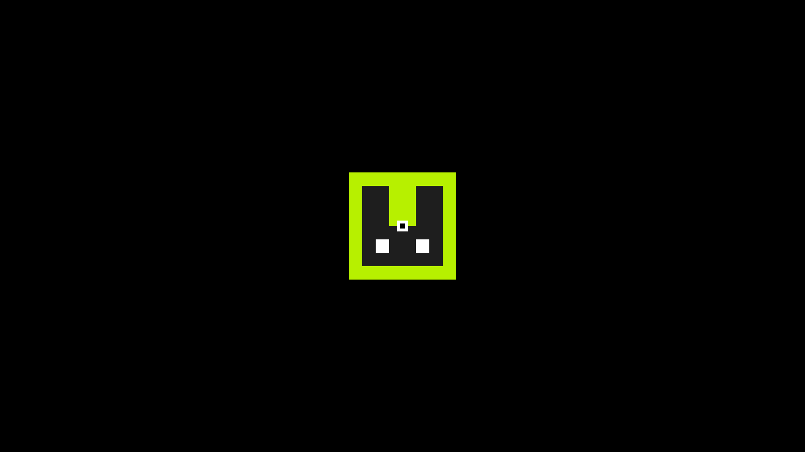

| Parameters          | Type      | Description                                       | Default Value  |
|---------------------|-----------|---------------------------------------------------|----------------|
| string              | `string`  | Image URL or color code format.                   | PizzaJS Logo   |
| [x, y]              | `number[]`| The top left position of the actor in pixels.     | [0, 0]         |
| [width, height]     | `number[]`| The width and height of the actor in pixels.      | [32, 32]       |
| [offsetX, offsetY]  | `number[]`| The offsets used for positioning the actor.       | [0, 0]         |

## Attributes

| Attributes                | Description                                                       |
|---------------------------|-------------------------------------------------------------------|
| `image`                   | Holds the image object if an image source is provided.            |
| `usingColor`              | Indicates whether the actor is using a color instead of an image. |
| `color`                   | Holds the color value if the actor is using a color.              |
| `conditions`              | Object holding various conditions for the actor.                  |
| `x, y`                    | Current position of the actor.                                    |
| `offsetX, offsetY`        | Offsets used for positioning.                                     |
| `drag`                    | Object for handling dragging functionality.                       |
| `hitbox`                  | Hitbox object for collision detection.                            |
| `width, height`           | Dimensions of the actor.                                          |
| `halfwidth, halfheight`   | Half of the width and height of the actor.                        |
| `pos`                     | Position coordinates of the actor.                                |
| `anglex, angley`          | Position coordinates used for angle calculations.                 |
| `angle`                   | Angle of rotation for the actor (in degrees).                     |
| `alpha`                   | Transparency of the actor.                                        |
| `radius`                  | The amount of rounding corners use array for changing independently each corner or a number to change all corners.                    |
| `stroke.active`           | A boolean flag indicating whether the stroke (outline) should be active or not.  |
| `stroke.color`           |  A string representing the color of the stroke in hexadecimal, RGB, or other supported formats.  |
| `stroke.width`           |  A numerical value representing the width of the stroke in pixels.  |
|`left, right, top, bottom` | Boundaries of the actor.                                          |
| `global.actors`           | Adds the object to global.actors for addons                       |

## Methods

### draw()

The draw() method is responsible for rendering the actor onto the canvas based on its current properties.

!!! Example
    ```js

    import * as pjs from "/source/modules/index.js"

    pjs.setup(1920, 1080, 1);

    let size = 256
    let x = pjs.canvas.width / 2 - size/2
    let y = pjs.canvas.height / 2 - size/2

    let MyActor = new pjs.actor("/source/icons/PizzaJS256x.png", [x, y], [size, size], [0, 0])

    window.addEventListener("pjsUpdate", () => {
        pjs.clear()
        MyActor.draw() 
    })

    pjs.start()
    ```

    

### `drawAnchorPoint()`

The drawAnchorPoint() method renders an anchor point for the actor on the canvas. (anchor point is from where the actor rotates)

!!! TIP
    Anchor Point can be offseted with offsetX, offsetY

!!! Example
    ```js
    import * as pjs from "/source/modules/index.js"

    pjs.setup(1920, 1080, 1);

    let size = 256
    let x = pjs.canvas.width / 2 - size/2
    let y = pjs.canvas.height / 2 - size/2

    let MyActor = new pjs.actor("/source/icons/PizzaJS256x.png", [x, y], [size, size], [0, 0])

    window.addEventListener("pjsUpdate", () => {
        pjs.clear()
        MyActor.draw()
        MyActor.drawAnchorPoint() // Draw the actor anchor point
    })

    pjs.start()
    ```

    

### `angletopoint(point)`

The method determines the angle between the actor's current position and the specified target point and makes the actor angle toward the point, considering the actor's center as the reference except there is an offset.

| Parameters          | Type      | Description                                       | Default Value  |
|---------------------|-----------|---------------------------------------------------|----------------|
| point               | `number[]`| The pos of the point                              | -              |

### `changeImage(string)`

Changes the image/color of the actor.

| Parameters          | Type      | Description                                       | Default Value  |
|---------------------|-----------|---------------------------------------------------|----------------|
| string              | `string`  | Image URL or color code format.                   | -              |

### `grow(x, y)`

Increases or decreases the size of the actor.

| Parameters          | Type      | Description                                       | Default Value  |
|---------------------|-----------|---------------------------------------------------|----------------|
| x                   | `number`  | Amount by which to increase width                 | -              |
| y                   | `number`  | Amount by which to increase height                | -              |
