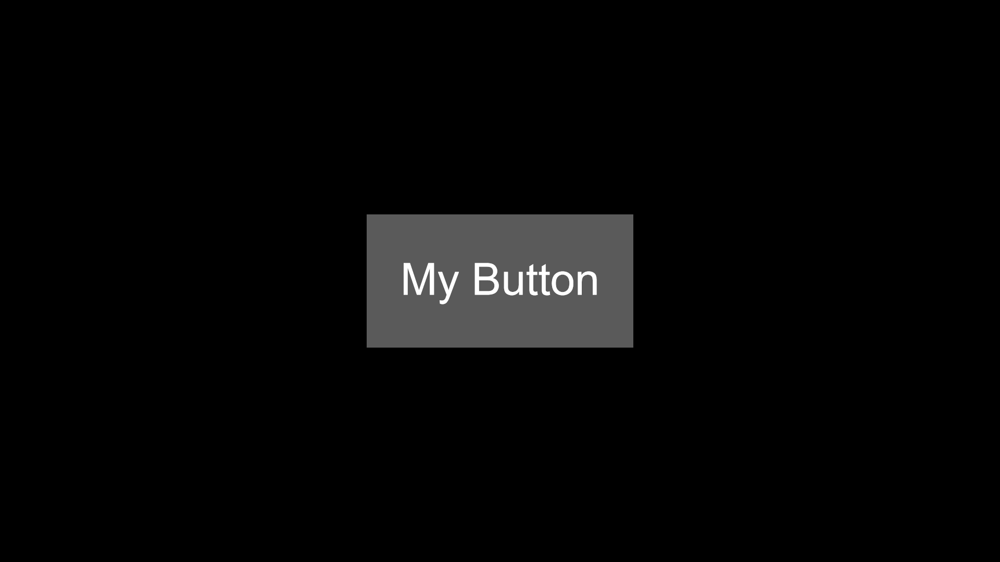
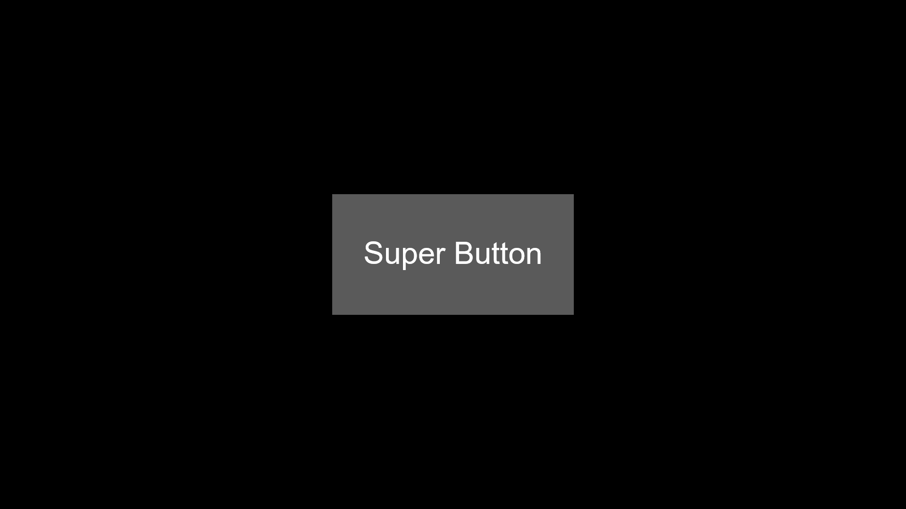

```js
new button("color: #FFFFFF", [0, 0], [64, 16], "Button", "sans-serif", "#000000", 16, 1000)
```

| Parameters          | Type      | Description                                                        | Default Value  |
|---------------------|-----------|--------------------------------------------------------------------|----------------|
| string              | `string`  | Image URL or color code format.                                    |"color:#FFFFFF" |
| [x, y]              | `number[]`| The top left position of the actor in pixels.                      | [0, 0]         |
| [width, height]     | `number[]`| The width and height of the actor in pixels.                       | [64, 16]       |
| text                | `string`  | The text of the button, if undefined it will be disabled.          | "Button"       |
| fontFamily          | `string`  | The fontFamily for the button text.                                | "sans-serif"   |
| textColor           | `string`  | The color of the text                                              | "#FFFFFF"      |
| textMargin          | `number`  | The margin of the text                                             | 0              |
| timeoutMS           | `number`  | The time it takes for the button to be able to be pressed again .  | 0              |

## Attributes

| Attributes                    | Description                                                                                                        |
|-------------------------------|--------------------------------------------------------------------------------------------------------------------|
| `image`                       | Holds the image object if an image source is provided.                                                             |
| `usingColor`                  | Indicates whether the actor is using a color instead of an image.                                                  |
| `color`                       | Holds the color value if the actor is using a color.                                                               |
| `x, y`                        | Current position of the actor.                                                                                     |
| `width, height`               | Dimensions of the actor.                                                                                           |
| `halfwidth, halfheight`       | Half of the width and height of the actor.                                                                         |
| `pos`                         | Position coordinates of the actor.                                                                                 |
| `text`                        | Object for handling text functionality.                                                                            |
| `text.active`                 | A boolean flag indicating whether the text should be active/shown or not.                                          |
| `text.color`                  | Color of the text.                                                                                                 |
| `text.text`                   | The current text of the button.                                                                                    |
| `text.size`                   | The size in px of the text.                                                                                        |
| `text.margin`                 | Margin for the text                                                                                                |
| `text.fontFamily`             | The fontFamily                                                                                                     |
| `text.baseline`               | Baseline for text `"top"`, `"middle"`, `"bottom"`, or `"alphabetic"`.                                              |
| `text.align`                  | Text alignment: `"start"`, `"end"`, `"left"`, `"right"`, or `"center"`.                                            |
| `text.stroke.active`          | A boolean flag indicating whether the stroke (outline) should be active or not.                                    |
| `text.stroke.color`           | A string representing the color of the stroke in hexadecimal, RGB, or other supported formats.                     |
| `text.stroke.width`           | A numerical value representing the width of the stroke in pixels.                                                  |
| `click`                       | Boolean that indicates if its being clicked.                                                                       |
| `hover`                       | Boolean that indicates if its being hovered.                                                                       |
| `hitbox`                      | Hitbox object for collision detection.                                                                             |
| `anglex, angley`              | Position coordinates used for angle calculations.                                                                  |
| `angle`                       | Angle of rotation for the actor (in degrees).                                                                      |
| `alpha`                       | Transparency of the actor.                                                                                         |
| `radius`                      | The amount of rounding corners use array for changing independently each corner or a number to change all corners. |
| `stroke.active`               | A boolean flag indicating whether the stroke (outline) should be active or not.                                    |
| `stroke.color`                | A string representing the color of the stroke in hexadecimal, RGB, or other supported formats.                     |
| `stroke.width`                | A numerical value representing the width of the stroke in pixels.                                                  |
|`left, right, top, bottom`     | Boundaries of the actor.                                                                                           |
| `timeout`                     | The timeout object                                                                                                 |

## Methods

### `draw()`

The draw() method is responsible for rendering the button onto the canvas based on its current properties.

!!! Example
    ```js

    import * as pjs from "/source/modules/index.js"

    pjs.setup(1920, 1080, 1);

    let size = 256
    let x = pjs.canvas.width / 2 - size
    let y = pjs.canvas.height / 2 - size / 2

    let MyButton = new pjs.button("color: #000000", [x, y], [size * 2, size], "My Button","sans-serif", "#FFFFFF", size * 0.5, 500)

    window.addEventListener("pjsUpdate", () => {
        pjs.clear()
        MyButton.draw()

        // Change color if hovered
        //if (MyButton.hover) {
        //    MyButton.color = "#FF0000"
        //}
        //else {
        //    MyButton.color = "#000000"
        //}

        // Indicate when the button is able to be pressed again
        //if(!MyButton.timeout.active){
        //    pjs.ctx.fillStyle = "#00FF00"
        //    pjs.drawtext("Can Click",[0,0],size*0.45)
        //}
        //else{
        //    pjs.ctx.fillStyle = "#FF0000"
        //    pjs.drawtext("Timeout",[0,0],size*0.45)
        //}

    })

    pjs.start()
    ```

    

### `setText()`

The setText() method changes the text and fits it to the button with a provided font and text

!!! failure
    setText() uses fitext that doens't properly fit text with some fonts.

| Parameters          | Type      | Description                                       | Default Value  |
|---------------------|-----------|---------------------------------------------------|----------------|
| text                | `string`  | The text to be changed                            | -              |
| fontFamily          | `string`  | The fontFamily that is goind to be changed        | -              |

!!! Example
    ```js
    import * as pjs from "/source/modules/index.js"

    pjs.setup(1920, 1080, 1);

    let size = 256
    let x = pjs.canvas.width / 2 - size
    let y = pjs.canvas.height / 2 - size / 2

    let MyButton = new pjs.button("color: #000000", [x, y], [size * 2, size], "My Button","sans-serif", "#FFFFFF", size * 0.5, 500);

    window.addEventListener("pjsUpdate", () => {
        pjs.clear()
        MyButton.draw()

        if (MyButton.click) {
            if (MyButton.text.text == "My Button") {
                MyButton.setText("Super Button", "sans-serif")
            }
            else {
                MyButton.setText("My Button", "sans-serif")
            }
        }

    })

    pjs.start()
    ```

    

    


### `changeImage(string)`

Changes the image/color of the button.

| Parameters          | Type      | Description                                       | Default Value  |
|---------------------|-----------|---------------------------------------------------|----------------|
| string              | `string`  | Image URL or color code format.                   | -              |

### `grow(x, y)`

Increases or decreases the size of the button.

| Parameters          | Type      | Description                                       | Default Value  |
|---------------------|-----------|---------------------------------------------------|----------------|
| x                   | `number`  | Amount by which to increase width                 | -              |
| y                   | `number`  | Amount by which to increase height                | -              |


