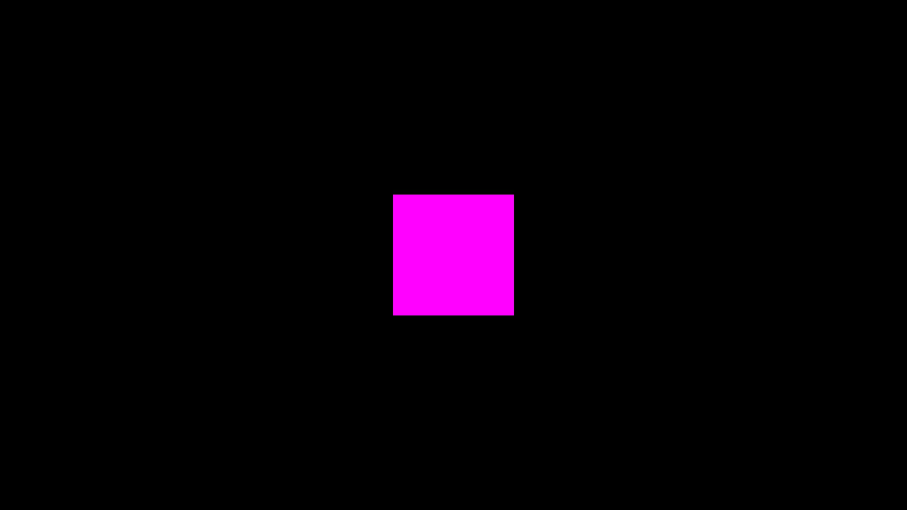

```jsn
new rect([x, y], [width, height], color)
```

| Parameters          | Type      | Description                                       | Default Value  |
|---------------------|-----------|---------------------------------------------------|----------------|
| [x, y]              | `number[]`| The top left position of the rect in pixels.     | [0, 0]         |
| [width, height]     | `number[]`| The width and height of the rect in pixels.      | [32, 32]       |
| color               | `string`  | color                                             | undefined      |

!!! note
    If color is `undefined` it will be randomized

## Attributes

| Attributes                | Description                                                       |
|---------------------------|-------------------------------------------------------------------|
| `color`                   | Holds the color value if the rect is using a color.              |
| `x, y`                    | Current position of the rect.                                    |
| `hitbox`                  | Hitbox object for collision detection.                            |
| `width, height`           | Dimensions of the rect.                                          |
| `halfwidth, halfheight`   | Half of the width and height of the rect.                        |
| `pos`                     | Position coordinates of the rect in an array x: [0], y: [1].                                |
| `anglex, angley`          |  Position coordinates used for positioning calculations. Has nothing in common with angle !                 |
| `angle`                   | Angle of rotation for the rect (in degrees).                     |
| `alpha`                   | Transparency of the rect.                                        |
| `radius`                  | The amount of rounding corners use array for changing independently each corner or a number to change all corners.                    |
| `stroke.active`           | A boolean flag indicating whether the stroke (outline) should be active or not.  |
| `stroke.color`           |  A string representing the color of the stroke in hexadecimal, RGB, or other supported formats.  |
| `stroke.width`           |  A numerical value representing the width of the stroke in pixels.  |

## Methods

### draw()

The draw() method is responsible for rendering the rect onto the canvas based on its current properties.

!!! Example
    ```js
    import { start, setup, clear, canvas, rect } from "/source/modules/index.js"
    import "/source/Addons/DefaultScreenshot.js"
    
    setup(1920, 1080, 1);
    
    let size = 256
    let x = canvas.width / 2 - size / 2
    let y = canvas.height / 2 - size / 2
    
    let Myrect = new rect([x, y], [size, size], "#FF00FF")
    
    window.addEventListener("pjsUpdate", () => {
        clear()
        Myrect.draw()
    })
    
    start()
    ```

    

