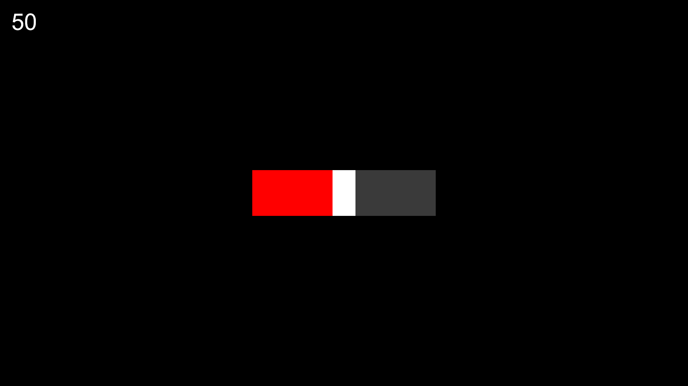
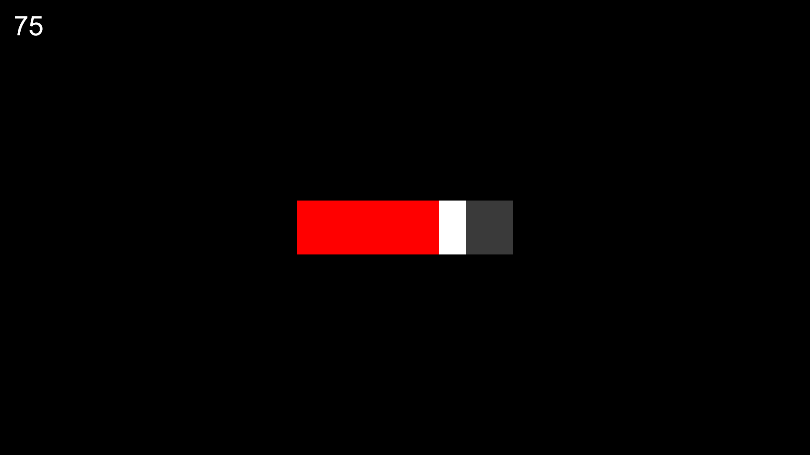

```js
new slider(background, thumb, [x, y], [width, height], thumbwidth, [minpercentage, maxpercentage], sliderfill, currentPercentage)
```

| Parameters                     | Type      | Description                                                          | Default Value  |
|--------------------------------|-----------|----------------------------------------------------------------------|----------------|
| background                     | `string`  | Image URL or color code representing the background of the slider.   | "color: #FF0000"   |
| thumb                          | `string`  | Image URL or color code representing the thumb.                      | "color: #aeaeae"   |
| [x, y]                         | `number[]`| Top left position of the slider in pixels.                           | [0, 0]         |
| [width, height]                | `number[]`| Width and height of the slider in pixels.                            | [64, 16]       |
| thumbwidth                     | `number`  | Width of the thumb.                                                  | 16             |
| [minpercentage, maxpercentage] | `number[]`| Minimum and maximum percentage values for the slider.                | [0, 100]       |
| sliderFill                     | `string`  | Color code representing the fill color of the slider.                | "#00FF00"        |
| currentPercentage              | `number`  | The initial percentage value of the slider.                          | 0              |

| Attributes                | Description                                                          |
|---------------------------|----------------------------------------------------------------------|
| `background`              | Holds the background image.                        |
| `BGusingColor`             | Indicates whether is using a color instead of an image in background.|
| `BGcolor`                  | Holds the color value of the slider background if is using a color.  |
| `thumb.image`            | Holds the thumb image                             |
| `thumb.usingColor`             | Indicates whether is using a color instead of an image for the thumb.|
| `thumb.color`                  | Holds the color value of the slider thumb if is using a color.       |
| `thumb.x, thumb.y`          | Current position of the thumb.                                       |
| `thumb.height`             | Height of the thumb                                                  |
| `thumb.width`              | Width of the thumb                                                   |
| `thumb.stroke.active`           | A boolean flag indicating whether the stroke (outline) should be active or not.  |
| `thumb.stroke.color`           |  A string representing the color of the stroke in hexadecimal, RGB, or other supported formats.  |
| `thumb.stroke.width`           |  A numerical value representing the width of the stroke in pixels.  |
| `thumb.blocked`            | Boolean that blocks movement if its true                             |
| `thumb.radius`                  | The amount of rounding corners use array for changing independently each corner or a number to change all corners.                    |
| `sliderBgColor              | Holds the color to fill in the percentage.                        |
| `x, y`                    | Current position of the slider.                                      |
| `maxpercentage`           | The maximum percentage the slider can reach.                         |
| `minpercentage`           | The minimum percentage the slider can reach.                         |
| `percentage`              | Current percentage the slider is in.                                 |
| `drag`                    | Object for handling dragging functionality. More info at `template/drag` in github.                          |
| `hitbox`                  | Hitbox object for collision detection.                               |
| `width, height`           | Dimensions of the slider.                                            |
| `pos`                     | Position coordinates of the actor in an array x: [0], y: [1].                                                |
| `anglex, angley`          | Position coordinates used for positioning calculations. Has nothing in common with angle !                    |
| `angle`                   | Angle of rotation for the slider (in degrees).                       |
| `alpha`                   | Transparency of the actor.                                           |
| `radius`                  | The amount of rounding corners use array for changing independently each corner or a number to change all corners.                    |
| `stroke.active`           | A boolean flag indicating whether the stroke (outline) should be active or not.  |
| `stroke.color`           |  A string representing the color of the stroke in hexadecimal, RGB, or other supported formats.  |
| `stroke.width`           |  A numerical value representing the width of the stroke in pixels.  |
|`left, right, top, bottom` | Boundaries of the actor.                                             |
| `click`                   | Boolean that indicates if the thumb is being clicked.                |
| `hover`                   | Boolean that indicates if the thumb is being hovered.                |

## Methods

### draw()

The draw() method is responsible for rendering the slider onto the canvas based on its current properties.

!!! Example
    ```js
    import { start, setup, clear, slider, canvas, drawtext, ctx } from "/source/modules/index.js"
    import "/source/Addons/DefaultScreenshot.js"
    
    setup(1920, 1080, 1);
    
    let size = 256
    let x = canvas.width / 2 - size
    let y = canvas.height / 2 - size / 4
    
    let MySlider = new slider("color:#3a3a3a", "color:#FFFFFF", [x, y], [size * 2, size / 2], size / 4, [0, 100], "#ff0000", 50)
    
    window.addEventListener("pjsUpdate", () => {
        clear()
        MySlider.draw()
        ctx.fillStyle = "#FFFFFF"
        drawtext(MySlider.percentage, [size / 8, size / 8], size / 4)
    })
    
    start()
    ```

    Untouched

    

    Moved

    


### `changeImage(stringbackground, stringthumb)`

Changes the image/color of the slider.

| Parameters          | Type      | Description                                          | Default Value  |
|---------------------|-----------|------------------------------------------------------|----------------|
| stringbackground    | `string`  | Image URL or color code representing the background. | -              |
| stringthumb         | `string`  | Image URL or color code representing the thumb       | -              |

