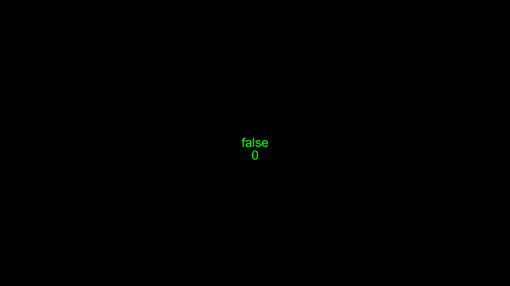
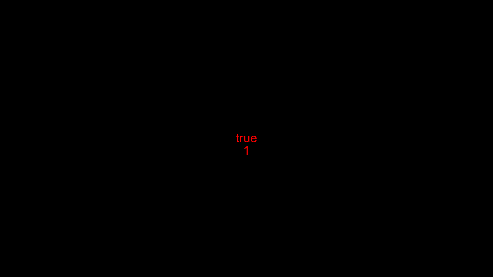

| Parameters          | Type      | Description                                           | Default Value  |
|---------------------|-----------|-------------------------------------------------------|----------------|
| timeMS              | `number`  | The time in ms of the delay before it can be started. | 1000           |


## Attributes

| Attributes       | Description                                                                    |
|------------------|--------------------------------------------------------------------------------|
| `timeMS`         | The time in ms of the delay before it can be started.                          |
| `active`         | Indicates whether the timeout is finished or not started and when its running. |
| `timeElapsed`    | Holds the time elapsed since start() up to timeMS in milliseconds.              |
| `timeLeft`       | The remaining time in milliseconds before the timeout completes.              |
| `updateTime`     | The interval in milliseconds for updating `timeElapsed` and `timeLeft`.              |
| `currentTime`    | The timestamp when the timeout was started.              |


## Methods

### start()

The start() method is responsible for starting the timeout (setting active to true for the time specified).

!!! Example
    ```js

    import * as pjs from "/source/modules/index.js"

    pjs.setup(1920, 1080, 1);

    let size = 48
    let x = pjs.canvas.width / 2 
    let y = pjs.canvas.height / 2

    let MyTimeout = new pjs.timeout(1500)

    window.addEventListener("pjsUpdate", () => {
        pjs.clear()
        if(pjs.mouse.click && !MyTimeout.active){
            MyTimeout.start()
        }
        if(MyTimeout.active){
            pjs.ctx.fillStyle = "#FF0000"
        }
        else{
            pjs.ctx.fillStyle = "#00FF00"
        }
        pjs.drawtext(MyTimeout.active,[x,y],size,"sans-serif","middle","center")
    })

    pjs.start()
    ```
    Before Clicking
    
    After Clicking
    
    After 1.5 seconds
    
