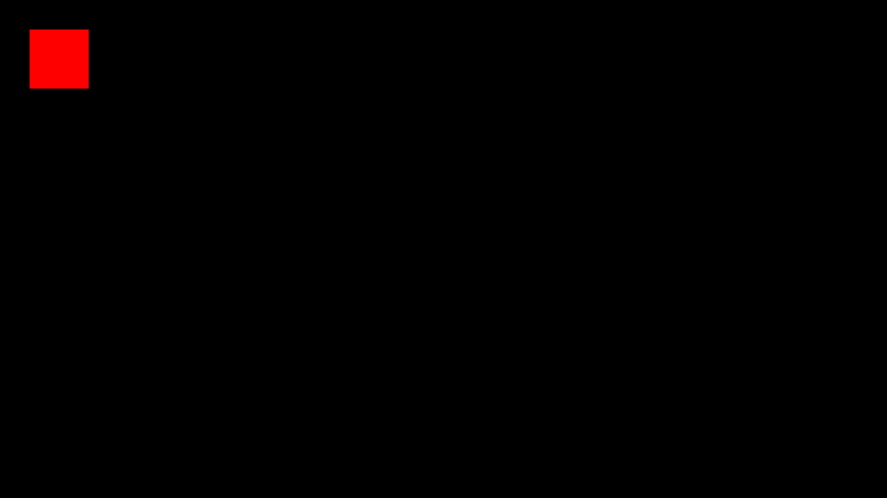

## **Load Image**

The `loadImage` function downloads an image from a provided URL and returns the src.

```js
loadImage(name,url);
```
!!! info
    The `loadImage` function is already implemented into all classes from PizzaJS.


| Parameters | Type        | Description                                                                 | Default Value |
|------------|-------------|-----------------------------------------------------------------------------|---------------|
| name       | `string`    | A name attached to the url accesible via image[name]                        | -   |
| url        | `string`    | The URL pointing to the image file to be downloaded and used.               | -   |


!!! Example
    ```js
    import * as pjs from "/source/modules/index.js"

    pjs.setup(1920, 1080, 1);

    let size = 256
    let x = pjs.canvas.width / 2 - size/2
    let y = pjs.canvas.height / 2 - size/2

    // pjs.loadImage("bunny,"bunny.png")
    // All classes that have an image or may contain one -
    // already have implemented the loadImage function.

    let actor = new pjs.actor("bunny.png", [x, y], [size, size], [0, 0])

    // Using name
    //let actor = new pjs.actor(pjs.image["bunny"], [x, y], [size, size], [0, 0])

    window.addEventListener("pjsUpdate", () => {
        pjs.clear()
        actor.draw()
    })

    pjs.start()
    ```

    

Bunny.png


## **Load Sound**

The `loadSound` function downloads a sound from a provided URL and returns the src.

```js
loadSound(url);
```
!!! info

    The `loadSound` function is already implemented into the sound class from PizzaJS.


| Parameters | Type        | Description                                                                 | Default Value |
|------------|-------------|-----------------------------------------------------------------------------|---------------|
| url        | `string`    | The URL pointing to the sound file to be downloaded and used.               | "undefined"   |


## **Clear**

The `clear` function erases all things from the canvas.
Additionaly it broadcast an event after clearing `pjsAfterClear`, meant for addons 

```js
clear();
```

## **Fill Rect**

The `fillRect` function draws a filled rect with the specified parameters.

```js
fillRect(x, y, width, height);
```


| Parameters | Type        | Description                                                                 | Default Value |
|------------|-------------|-----------------------------------------------------------------------------|---------------|
| x          | `number`    | the x position for the rect                                                 | 0             |
| y          | `number`    | the y position for the rect                                                 | 0             |
| width      | `number`    | the width of the rect                                                       | 0             |
| height     | `number`    | the height of the rect                                                      | 0             |


!!! Example
    ```js
    import * as pjs from "/source/modules/index.js"


    pjs.setup(1920, 1080, 1);

    window.addEventListener("pjsUpdate", () => {
        pjs.clear();
        pjs.ctx.fillStyle = "red";
        pjs.fillRect(64,64,128,128);
        // Draws a rect form 64,64 with a width and height of 128
    })

    pjs.start()
    ```

    
