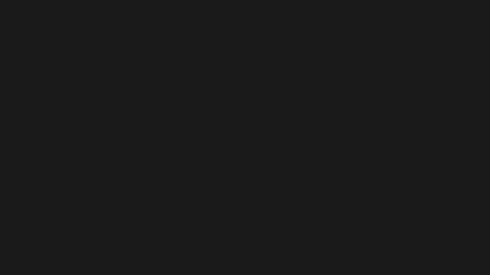

## **Setup**
The `setup` function is used to configure and set up a canvas with specific width, height, and other configurations.
When executed a frame should appear on the web browser.

If you dont want the canvas to stick to the sides of the screen add any float to reduce the size but maintaining the pixels resolution 
(from 0 to 1)

```js
setup(width, height, marginMultiplier, listeners);
```

| Parameters          | Type      | Description                                       | Default Value  |
|---------------------|-----------|---------------------------------------------------|----------------|
| width               | `number`  | The width of the canvas.                          | -              |
| height              | `number`  | The height of the canvas.                         | -              |
| marginMultiplier    | `number`  | The multiplier for adjusting margin.              | 1              |
| listeners           | `boolean` | Boolean to determine whether to set up listeners. | true           |


!!! Example
    ```js
    import { start, setup, clear } from "/source/modules/index.js"
    import "/source/Addons/DefaultScreenshot.js"

    setup(1920, 1080, 1, false)
    ```

    

## **Start**

The `start` function initiates the main loop.

```js
start();
```

!!! Example
    ```js
    import { start, setup, clear } from "/source/modules/index.js"
    import "/source/Addons/DefaultScreenshot.js"
    
    setup(1920, 1080, 1, false)
    
    window.addEventListener("pjsUpdate", (e) => {
        const { deltaTime, fps } = e.detail // Get current deltaTime and FrameRate. This can be replaced by time.delta and 1 / time.delta
        clear()
    })
    
    start()
    
    ```


