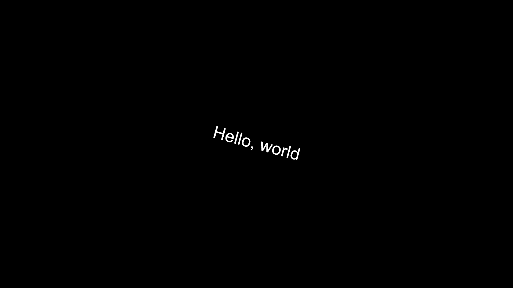
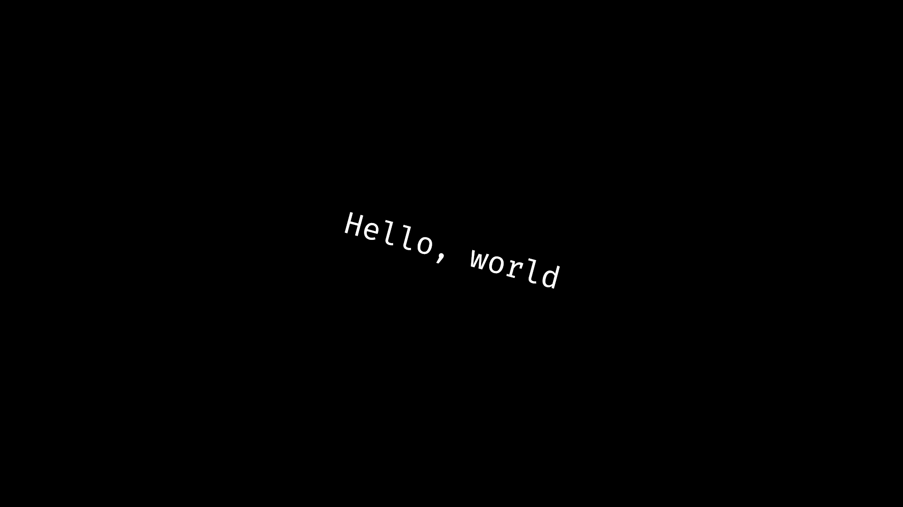

## **Draw Text**

The `drawtext` function is used to draw text on the canvas with specified parameters.

```js
drawtext(text, [x, y], fontSize, fontFamily, baseline, textAlign, angle, alpha);
```

| Parameters | Type        | Description                                                                 | Default Value |
|------------|-------------|-----------------------------------------------------------------------------|---------------|
| text       | `string`    | The text to be drawn.                                                       | "undefined"   |
| [x, y]     | `number[]`  | The coordinates [x, y] where the text will be drawn.                        | [0, 0]        |
| fontSize   | `number`    | The size of the font in pixels.                                             | 24            |
| fontFamily | `string`    | The font family to use.                                                     | "sans-serif"  |
| baseline   | `string`    | The text baseline: `"top"`, `"middle"`, `"bottom"`, or `"alphabetic"`.      | "top"         |
| textAlign  | `string`    | The text alignment: `"start"`, `"end"`, `"left"`, `"right"`, or `"center"`. | "start"       |
| angle      | `number`    | The rotation angle of the text in degrees.                                  | 0             |
| alpha      | `number`    | The global alpha (transparency) value, between `0.0` and `1.0`.             | 1.0           |


!!! Example
    ```js
    import * as pjs from "/source/modules/index.js"

    pjs.setup(1920, 1080, 1,true);

    // Calculate the middle of the canvas
    let x = pjs.canvas.width / 2;
    let y = pjs.canvas.height / 2;

    window.addEventListener("pjsUpdate", () => {
        pjs.clear(); // Clear the canvas
        pjs.ctx.fillStyle = "white"; // Change color to white
        pjs.drawtext("Hello, world", [x, y], 64, "sans-serif", "middle", "center", 15, 1);
    })

    pjs.start();
    ```

    

## **Load Font**

The loadFont function asynchronously downloads a font from a provided URL and adds it to the document's fonts using the specified font family.

```js
loadFont(fontFamily, fontURL);
```

| Parameters | Type        | Description                                                                 | Default Value |
|------------|-------------|-----------------------------------------------------------------------------|---------------|
| fontFamily | `string`    | The font family name to assign to the loaded font.                          | "undefined"   |
| fontURL    | `string`    | The URL pointing to the font file to be downloaded and used.                | "undefined"   |

!!! Example
    ```js
    import * as pjs from "/source/modules/index.js"
    
    pjs.setup(1920, 1080, 1,true);
    
    //Load the font and set it as "FiraCode"
    pjs.loadFont("FiraCode","/source/fonts/FiraCode/FiraCode-Regular.ttf");
    
    
    let x = pjs.canvas.width / 2;
    let y = pjs.canvas.height / 2;
    
    window.addEventListener("pjsUpdate", () => {
        pjs.clear();
        pjs.ctx.fillStyle = "white";
    
        // Change the fontFamily to FiraCode
        pjs.drawtext("Hello, world", [x, y], 64, "FiraCode", "middle", "center", 15, 1);
    })
    
    pjs.start();
    ```
    
    

## **Fit Text**
!!! failure

    Doens't properly fit text in some cases.

Tries to fit a text with the sepecified width, height and other parameters.

Returns the fontSize tha will fit with the provided data.

```js
fitText(text, width, height, fontFamily);
```

| Parameters | Type        | Description                                                                 | Default Value |
|------------|-------------|-----------------------------------------------------------------------------|---------------|
| text       | `string`    | The text .                                                                  | -             |
| width      | `number`    | The size of the max width the text can be in.                               | -             |
| height     |  `number`   | The size of the max height the text can be in.                              | -             |
| fontFamily | `string`    | The font family used for measuring the text.	                             | -             |

## **Measure Text Width**

The measureTextWidth function calculates the width of a provided text string with a specified font size and font family.

```js
measureTextWidth(text, fontSize, fontFamily);
```

| Parameters | Type        | Description                                                                 | Default Value |
|------------|-------------|-----------------------------------------------------------------------------|---------------|
| text       | `string`    | The text to be measured.                                                    | "undefined"   |
| fontSize   | `number`    | The size of the font in pixels.                                             | 24            |
| fontFamily | `string`    | The font family used for measuring the text.	                             | "sans-serif"  |

