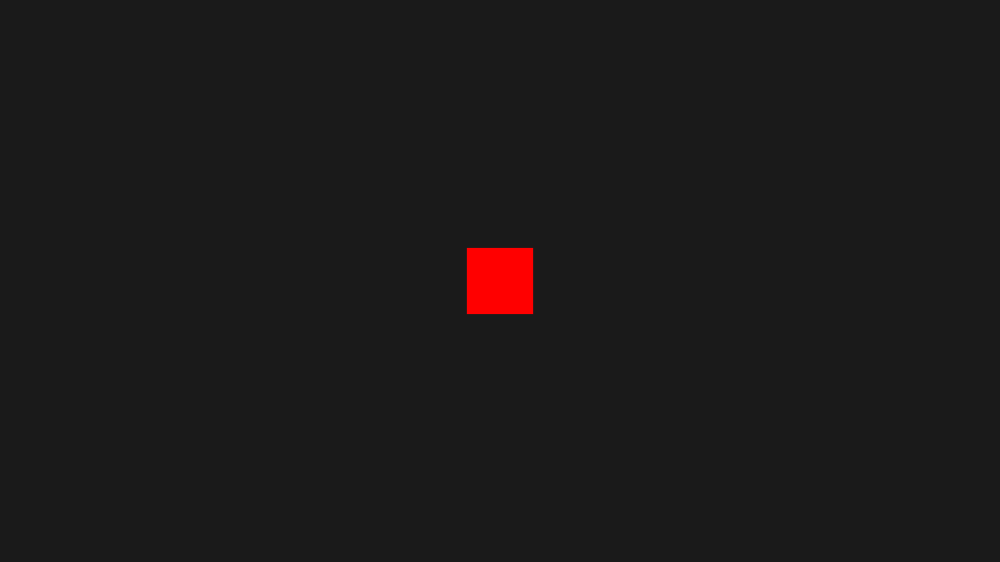

# **Welcome to PizzaJS Docs**   
<a class="github-button" id="issues" href="https://github.com/joaquinlarroca/pizzajs/issues" data-size="large" data-color-scheme="no-preference: dark; light: light; dark: dark;" data-icon="octicon-issue-opened" data-show-count="true" aria-label="Issue joaquinlarroca/pizzajs on GitHub">Issues</a>
<a class="github-button" href="https://github.com/joaquinlarroca/pizzajs" data-size="large" data-color-scheme="no-preference: dark; light: light; dark: dark;" data-icon="octicon-star" data-show-count="true" aria-label="Star joaquinlarroca/pizzajs on GitHub">Star</a>
<a class="github-button" href="https://github.com/joaquinlarroca/pizzajs/fork" data-color-scheme="no-preference: dark; light: light; dark: dark;" data-icon="octicon-repo-forked" data-size="large" data-show-count="true" aria-label="Fork joaquinlarroca/pizzajs on GitHub">Fork</a>
<a class="social-button" href="https://discord.gg/BmNS5aBEPT" data-color-scheme="no-preference: discord; light: discord; dark: discord;" data-icon="discord" data-size="large" data-show-count="false" aria-label="e">Discord</a>

## Importing PizzaJS
1. Download latest version from github.

Make sure to have PizzaJS files as the `template/project` as an alternative use the template for your project provided in [github at `template/project`](https://github.com/joaquinlarroca/pizzajs/tree/main/template/project/)

!!! Example
    ```
    My_PizzaJS_Project/
    │
    ├── index.html
    │
    ├── main.js
    │
    └── source/
        │
        ├── modules/
        │   │
        │   ├── classes.js
        │   │
        │   ├── functions.js
        │   │
        │   └── global.js
        │   │
        │   └── index.js
        │   │
        │   └── listener.js
    ```
    


```js 
// Use `pjs` or anything as a prefix for PizzaJS

// import all
import * as pjs from "/source/modules/index.js"
```

```js 
// Use PizzaJS without a prefix
// Import global and image
import { global, image } from '/source/modules/global.js'
// Import functions
import { initLoaderCheck, canvas, ctx, drawtext, loadImage, loadSound, loadFont, fillRect, setup, start, clear, fitText, measureTextWidth } from '/source/modules/functions.js';
// Import listeners
import { setupAllEventListeners, setupMouseListener, setupResizeListener, setupKeyboardListener, keyPressed, mouse, pressedKeys } from '/source/modules/listener.js';
// Import all classes
import { actor, button, hitbox, hitbox2, rect, sound, slider } from '/source/modules/classes.js';

// Starts the loadCheck
initLoaderCheck()
```

## Global object
| Attributes                | Description                                                       |
|---------------------------|-------------------------------------------------------------------|
| `version`                 |  Holds the current version in a string            |
| `build`                   | Current build            |
| `debug`                   | Just as a feature. No class has any special atribute when its true.            |
| `actors`                  | An array with all the actors.            |
| `buttons`                 | An array with all the buttons.             |
| `hasLoaded`               | Indicator that tells if all assets where loaded.           |
| `toLoad`                  | A number that show how many things it has to load.            |
| `Loaded`                  | A number that show how many things loaded.            |
| `loadingTime`             | Default max loading time.            |
| `hasSetup`                | A boolean that indicates if it has been already setted up.            |
| `setupWidth`              | Width of the canvas when it was setted up            |
| `setupHeight`             | Height of the canvas when it was setted up            |
| `lastTimestamp`           | Used for deltaTime calculation.            |
| `deltaTime`               | Current deltaTime.            |
| `_ImagesLoadedURL_`       | All images loaded using loadImage();            |
| `_SoundsLoadedURL_`       | All sounds loaded using loadSound();            |
| `errors`                  | A set that has all current errors in PizzaJS            |

!!! Example
    ```js
    import * as pjs from "/source/modules/index.js"

    pjs.setup(1920, 1080, 1);

    console.log(pjs.global.setupWidth);
    ```

    Output: `1920`


## How to use color code format

On classes instead of putting an image, color can by used by simply adding `color:` before the color wether is on hex, rgb, rgba, etc.

!!! Example

    ```js
    import * as pjs from "/source/modules/index.js"

    pjs.setup(1920, 1080, 1);

    let size = 128
    let x = pjs.canvas.width / 2 - size/2
    let y = pjs.canvas.height / 2 - size/2

    let actor = new pjs.actor("color:#FF0000", [x, y], [size, size], [0, 0])

    window.addEventListener("pjsUpdate", () => {
        pjs.clear()
        actor.draw()
    })

    pjs.start()
    ```
    


<!-- Place this tag in your head or just before your close body tag. -->
<script async defer src="https://buttons.github.io/buttons.js"></script>

<!-- Social buttons. modified  -->
<script async defer src="./social-buttons.js"></script>

