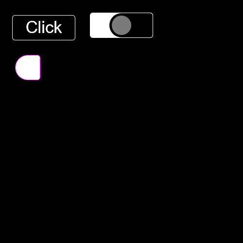

# **Welcome to PizzaJS Docs**   
<a class="github-button" id="issues" href="https://github.com/joaquinlarroca/pizzajs/issues" data-size="large" data-color-scheme="no-preference: dark; light: light; dark: dark;" data-icon="octicon-issue-opened" data-show-count="true" aria-label="Issue joaquinlarroca/pizzajs on GitHub">Issues</a>
<a class="github-button" href="https://github.com/joaquinlarroca/pizzajs" data-size="large" data-color-scheme="no-preference: dark; light: light; dark: dark;" data-icon="octicon-star" data-show-count="true" aria-label="Star joaquinlarroca/pizzajs on GitHub">Star</a>
<a class="github-button" href="https://github.com/joaquinlarroca/pizzajs/fork" data-color-scheme="no-preference: dark; light: light; dark: dark;" data-icon="octicon-repo-forked" data-size="large" data-show-count="true" aria-label="Fork joaquinlarroca/pizzajs on GitHub">Fork</a>
<a class="social-button" href="https://discord.gg/BmNS5aBEPT" data-color-scheme="no-preference: discord; light: discord; dark: discord;" data-icon="discord" data-size="large" data-show-count="false" aria-label="e">Discord</a>

## Importing PizzaJS
### 1. Download latest version from github.

Make sure to have PizzaJS files as the `template/project` as an alternative use the template for your project provided in [github at `template/project`](https://github.com/joaquinlarroca/pizzajs/tree/main/template/project/)

!!! Example
    ```
    My_PizzaJS_Project/
    │
    ├── index.html
    │
    ├── main.js
    │
    └── source/
        │
        ├── modules/
        │   │
        │   ├── classes.js
        │   │
        │   ├── functions.js
        │   │
        │   └── global.js
        │   │
        │   └── index.js
        │   │
        │   └── listener.js
    ```
    

### 2. Use any importing method

```js 
// Use `pjs` or anything as a prefix for PizzaJS

// import all
import * as pjs from "/source/modules/index.js"
```

```js 
// Use PizzaJS without a prefix
// Import global
import { global, image, time } from './source/modules/global.js'
// Import functions
import { initLoaderCheck, lerp, canvas, ctx, drawtext, loadImage, loadSound, loadFont, fillRect, setup, start, clear, fitText, measureTextWidth, shakeScreen } from './source/modules/functions.js';
// Import listeners
import { setupAllEventListeners, setupMouseListener, setupResizeListener, setupKeyboardListener, keyPressed, mouse, pressedKeys, preventKeys } from './source/modules/listener.js';
// Import all classes
import { actor, button, hitbox, hitbox2, hitboxCircle, rect, sound, slider, timeout, sound2 } from './source/modules/classes.js';
// Starts the loadCheck
initLoaderCheck()
```

After choosing the import method, start creating your game or project. :D
## Global object
| Attributes                | Description                                                       |
|---------------------------|-------------------------------------------------------------------|
| `version`                 |  Holds the current version in a string            |
| `build`                   | Current build            |
| `debug`                   | Just as a feature. No class has any special atribute when its true.            |
| `all`                     | An array that holds all actors,sliders,buttons and rects.             |
| `actors`                  | An array with all the actors.            |
| `buttons`                 | An array with all the buttons.             |
| `sliders`                 | An array with all the sliders.             |
| `rects`                   | An array with all the rects.             |
| `sounds`                  | An array that holds all sounds.             |
| `fps`                     | Current fps.            |
| `hasLoaded`               | Indicator that tells if all assets where loaded.           |
| `toLoad`                  | A number that show how many things it has to load.            |
| `Loaded`                  | A number that show how many things loaded.            |
| `loadingTime`             | Default max loading time.            |
| `hasSetup`                | A boolean that indicates if it has been already setted up.            |
| `setupWidth`              | Width of the canvas when it was setted up            |
| `setupHeight`             | Height of the canvas when it was setted up            |
| `shakingScreen`           | Indicates if the screen is shaking            |
| `allListenersHadSetup`    | Indicates if all listeners had been setted up            |
| `mouseListenersHadSetup`  | Indicates if the mouse listener has been setted up            |
| `keyboardListenersHadSetup`  | Indicates if the keyboard listener has been setted up            |
| `resizeListenersHadSetup`  | Indicates if the resize listener has been setted up            |
| `_ImagesLoadedURL_`       | All images loaded using loadImage();            |
| `_SoundsLoadedURL_`       | All sounds loaded using loadSound();            |
| `errors`                  | A set that has all current errors in PizzaJS            |

!!! Example
    ```js
    import { setup, global } from "/source/modules/index.js"

    setup(1920, 1080, 1);

    console.log(global.setupWidth);
    ```

    Output: `1920`

## Time object
| Attributes                | Description                                                       |
|---------------------------|-------------------------------------------------------------------|
| `delta`                   |  Represents the time elapsed between the current frame and the previous frame. This attribute, commonly referred to as deltaTime.            |
| `time`                    |  Each frame time.delta is added. Could be used for animations            |
| `scale`                   | Represents a scaling factor for some operation  |
| `frameCount`              | How many frames it rendered since the start.            |


!!! Example
    ```js
    import { setup, time, start } from "/source/modules/index.js"

    setup(1920, 1080, 1);

    start()

    let timeout = setTimeout(() => {
        console.log( Math.round( 1 / time.delta ) ); // 1 / time.delta = FPS
    }, 100);
    ```

    Output: `60`

## Events

### pjsUpdate
- `Trigger:` This event is triggered after the start() function is called. And calls itself each frame
- `Purpose:` It indicates update or initialization process has taken place.

### pjsAfterUpdate
- `Trigger:` This event occurs after the pjsUpdate event.
- `Purpose:` Made for drawing on top of what is drawn on `pjsUpdate` generally used for Addons.

### pjsAfterClear
- `Trigger:` This event is triggered after calling the clear() function.
- `Purpose:` Made for drawing before `pjsUpdate` generally used for Addons.

## How to use color code format

On classes instead of putting an image, color can by used by simply adding `color:` before the color wether is on hex, rgb, rgba, etc.

!!! Example

    ```js
    import { start, setup, clear, canvas, actor } from "/source/modules/index.js"
    import "/source/Addons/DefaultScreenshot.js"

    setup(1920, 1080, 0.9);

    let size = 128
    let x = canvas.width / 2 - size/2
    let y = canvas.height / 2 - size/2

    let actor1 = new actor("color:#FF0000", [x, y], [size, size], [0, 0])

    window.addEventListener("pjsUpdate", () => {
        clear()
        actor1.draw()
    })

    start()
    ```
    


## Using radius and stroke property
!!! Example 
    ```js
    import { start, setup, clear, button, slider, actor } from "/source/modules/index.js"
    import "/source/Addons/DefaultScreenshot.js"
    setup(500, 500, 1);

    let actora = new actor(undefined, [32, 114], [50, 50], [0, 0])

    let buttona = new button("color: #000000", [26, 32], [128, 50], "Click", "sans-serif", "#FFFFFF", 25, 500)

    let slidera = new slider("color: #000000", "color: rgb(122.5,122.5,122.5)", [186, 32], [128, 50], 40, [0, 100], "#FFFFFF", 50)

    actora.stroke.active = true
    actora.stroke.color = "#FF00FF"
    actora.stroke.width = 2
    actora.radius = [25, 5, 5, 25]

    buttona.stroke.active = true
    buttona.stroke.width = 2
    buttona.radius = 5

    slidera.stroke.active = true
    slidera.stroke.width = 2
    slidera.radius = 5

    slidera.thumb.stroke.active = true
    slidera.thumb.stroke.width = 10
    slidera.thumb.stroke.color = "#000000"
    slidera.thumb.radius = 25
    slidera.thumb.height = 40

    window.addEventListener("pjsUpdate", () => {
        clear()
        actora.draw()
        buttona.draw()
        slidera.draw()
    })
    start()
    ```

    

## :octicons-law-24: Licenses

### PizzaJS license
```txt
MIT License

Copyright (c) 2024 Joaquin Larroca

Permission is hereby granted, free of charge, to any person obtaining a copy
of this software and associated documentation files (the "Software"), to deal
in the Software without restriction, including without limitation the rights
to use, copy, modify, merge, publish, distribute, sublicense, and/or sell
copies of the Software, and to permit persons to whom the Software is
furnished to do so, subject to the following conditions:

The above copyright notice and this permission notice shall be included in all
copies or substantial portions of the Software.

THE SOFTWARE IS PROVIDED "AS IS", WITHOUT WARRANTY OF ANY KIND, EXPRESS OR
IMPLIED, INCLUDING BUT NOT LIMITED TO THE WARRANTIES OF MERCHANTABILITY,
FITNESS FOR A PARTICULAR PURPOSE AND NONINFRINGEMENT. IN NO EVENT SHALL THE
AUTHORS OR COPYRIGHT HOLDERS BE LIABLE FOR ANY CLAIM, DAMAGES OR OTHER
LIABILITY, WHETHER IN AN ACTION OF CONTRACT, TORT OR OTHERWISE, ARISING FROM,
OUT OF OR IN CONNECTION WITH THE SOFTWARE OR THE USE OR OTHER DEALINGS IN THE
SOFTWARE.
```
### buttons.js
This page uses a modified version of github buttons.js.
Modified version is located in `pizzajs/mkdocs/social-buttons.js`.
Original version at [https://github.com/buttons/github-buttons/blob/main/dist/buttons.js](https://github.com/buttons/github-buttons/blob/main/dist/buttons.js).

```txt
BSD 2-Clause License

Copyright (c) 2023, なつき
All rights reserved.

Redistribution and use in source and binary forms, with or without
modification, are permitted provided that the following conditions are met:

1. Redistributions of source code must retain the above copyright notice, this
  list of conditions and the following disclaimer.

2. Redistributions in binary form must reproduce the above copyright notice,
  this list of conditions and the following disclaimer in the documentation
  and/or other materials provided with the distribution.

THIS SOFTWARE IS PROVIDED BY THE COPYRIGHT HOLDERS AND CONTRIBUTORS "AS IS"
AND ANY EXPRESS OR IMPLIED WARRANTIES, INCLUDING, BUT NOT LIMITED TO, THE
IMPLIED WARRANTIES OF MERCHANTABILITY AND FITNESS FOR A PARTICULAR PURPOSE ARE
DISCLAIMED. IN NO EVENT SHALL THE COPYRIGHT HOLDER OR CONTRIBUTORS BE LIABLE
FOR ANY DIRECT, INDIRECT, INCIDENTAL, SPECIAL, EXEMPLARY, OR CONSEQUENTIAL
DAMAGES (INCLUDING, BUT NOT LIMITED TO, PROCUREMENT OF SUBSTITUTE GOODS OR
SERVICES; LOSS OF USE, DATA, OR PROFITS; OR BUSINESS INTERRUPTION) HOWEVER
CAUSED AND ON ANY THEORY OF LIABILITY, WHETHER IN CONTRACT, STRICT LIABILITY,
OR TORT (INCLUDING NEGLIGENCE OR OTHERWISE) ARISING IN ANY WAY OUT OF THE USE
OF THIS SOFTWARE, EVEN IF ADVISED OF THE POSSIBILITY OF SUCH DAMAGE.
```
<!-- Place this tag in your head or just before your close body tag. -->
<script async defer src="https://buttons.github.io/buttons.js"></script>

<!-- Social buttons. modified  -->
<script async defer src="./social-buttons.js"></script>

