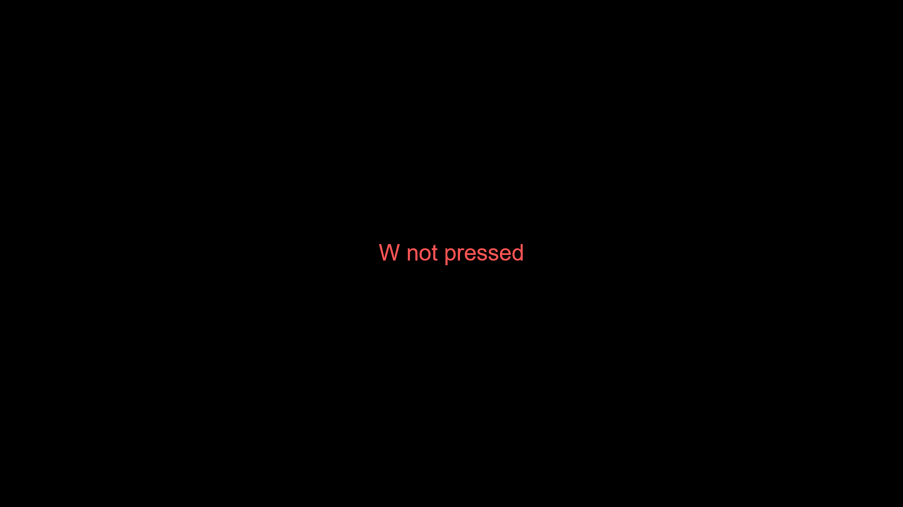

## Mouse object

| variables                 | Description                                                          |
|---------------------------|----------------------------------------------------------------------|
| `x`                       | Indicates the mouse position in the x axis.                          |
| `y`                       | Indicates the mouse position in the y axis.|
| `pos`                     | An array with x and y. |
| `click`                   | Is true if the mouse is being clicked and its false when its not clicked. (Supports touch but no dragging) |
| `objectSelected`          | It has the object / class currently selected. (To understand more read `template/dragTemplate.js`)|

!!! example
    ```js
    console.log(mouse.pos);
    ```
    output: [125,253]


## Key pressed
```js
keyPressed(key);
```

Return true if the key given is being pressed.

| Parameters                     | Type      | Description                                                          | Default Value  |
|--------------------------------|-----------|----------------------------------------------------------------------|----------------|
| key                            | `string`  | The key you want to know if its pressed                              | -              | 

!!! example
    ```js
    import * as pjs from "/source/modules/index.js"

    pjs.setup(1920, 1080, 1);

    let size = 48
    let x = pjs.canvas.width / 2
    let y = pjs.canvas.height / 2

    window.addEventListener("pjsUpdate", () => {
        pjs.clear()
        if(pjs.keyPressed("w")){
            pjs.ctx.fillStyle = "#55FF55"
            pjs.drawtext("W pressed",[x,y],size,"sans-serif","middle","center")
        }   
        else{
            pjs.ctx.fillStyle = "#FF5555"
            pjs.drawtext("W not pressed",[x,y],size,"sans-serif","middle","center")
        }
    })

    pjs.start()
    ```
    Not pressing W
    

    Pressing W
    

## Set up listeners
When putting `setup(1920,1080,1,false)` you are disabling automatic initialization of listeners. If you want to do it manually just use `setupAllEventListeners()`

!!! Example
    ```js
    import * as pjs from "/source/modules/index.js"

    pjs.setup(1920, 1080, 1, false);

    pjs.setupAllEventListeners()

    // pjs.setupMouseListener() for setting up only the mouse.

    // pjs.setupKeyboardListener() for setting up only the keyboard and keyPressed function.

    // pjs.setupResizeListener() for setting up the automatic resize of the game when the windows is resized.
    ```